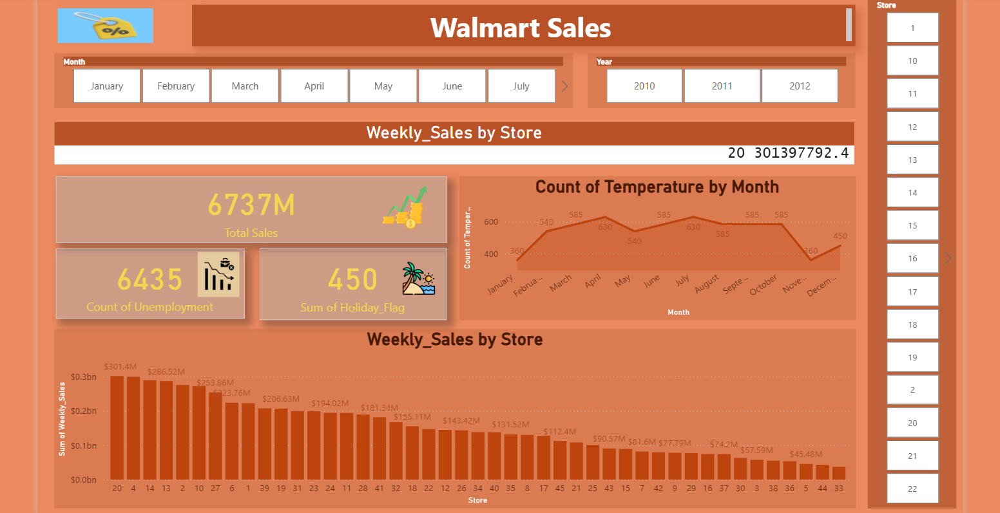

# 🛒 Walmart Sales Analysis Dashboard

An interactive **Power BI Dashboard** designed to analyze Walmart sales performance across different stores, months, and years. This dashboard transforms raw sales data into meaningful business insights using **Power Query**, **Data Modeling**, and **DAX**, enabling data-driven decision-making through interactive visualizations.

---

# 📊 Dashboard Preview

> Replace the image below with your dashboard screenshot.



---

# 🎯 Business Problem

Retail companies generate massive amounts of sales data every day. Without proper analysis, it becomes difficult to identify high-performing stores, monitor sales trends, or understand how external factors affect business performance.

This dashboard provides an interactive solution for monitoring sales performance and uncovering valuable insights that support strategic business decisions.

---

# 📌 Objectives

- Analyze Walmart's overall sales performance.
- Compare weekly sales across different stores.
- Identify the highest and lowest performing stores.
- Analyze monthly sales trends.
- Explore the relationship between sales and environmental factors.
- Build an interactive dashboard for business users.

---

# 📂 Dataset Information

The dataset contains historical Walmart sales data including:

| Column | Description |
|---------|-------------|
| Store | Store Number |
| Date | Weekly Sales Date |
| Weekly_Sales | Weekly Revenue |
| Holiday_Flag | Holiday Indicator |
| Temperature | Average Temperature |
| Fuel_Price | Fuel Price |
| CPI | Consumer Price Index |
| Unemployment | Unemployment Rate |

---

# 🛠️ Tools & Technologies

- **Power BI Desktop**
- **Power Query**
- **DAX**
- **Data Modeling**
- **Data Visualization**

---

# ⚙️ Data Preparation

The dataset was cleaned and transformed using **Power Query** by:

- Handling missing values
- Correcting data types
- Removing unnecessary columns
- Preparing the dataset for analysis

---

# 📐 Data Modeling

The project includes:

- Data Relationships
- DAX Measures
- Interactive Filters
- Optimized Data Model

---

# 📈 Dashboard Features

## 🔹 KPI Cards

- 💰 Total Sales
- 📉 Unemployment Count
- 🎉 Holiday Flag Summary

---

## 🔹 Interactive Slicers

- Month
- Year
- Store

---

## 🔹 Visualizations

- Weekly Sales by Store
- Monthly Temperature Trend
- KPI Summary Cards
- Dynamic Filtering

---

# 📊 Key Insights

- 💰 Total Sales exceeded **6.7 Billion**.
- 🏆 **Store 20** generated the highest weekly sales.
- 📈 Sales performance differs significantly between stores.
- 🌡️ Temperature follows a seasonal pattern throughout the year.
- 🎉 Holiday periods impact weekly sales trends.

---

# 📋 Skills Demonstrated

✔ Data Cleaning

✔ Data Transformation

✔ Data Modeling

✔ DAX Measures

✔ Power Query

✔ Interactive Dashboard Design

✔ Business Intelligence

✔ Data Visualization

✔ KPI Reporting

---

# 📁 Project Structure

```
Walmart-Sales-Dashboard
│
├── Walmart Sales Dashboard.pbix
├── README.md
└── images
    └── dashboard.png
```

---

# 🚀 How to Use

1. Download the `.pbix` file.
2. Open it using **Power BI Desktop**.
3. Refresh the dataset if required.
4. Use the slicers to filter the report by:
   - Month
   - Year
   - Store
5. Explore KPIs and visualizations to gain business insights.

---

# 📷 Dashboard Highlights

### 📌 Executive Overview
Displays the most important KPIs including Total Sales, Holiday Count, and Unemployment Count.

### 📌 Sales Performance
Ranks stores based on weekly sales performance.

### 📌 Trend Analysis
Shows monthly temperature trends that can be compared alongside sales data.

### 📌 Interactive Exploration
Users can dynamically filter data by Month, Year, and Store for deeper analysis.

---

# 💼 Business Value

This dashboard enables decision-makers to:

- Monitor overall business performance.
- Identify top-performing stores.
- Detect sales trends over time.
- Support strategic planning using interactive analytics.

---

# 👩‍💻 Author

**Raneem Sameh**

---

## ⭐ If you like this project, don't forget to give it a Star!
